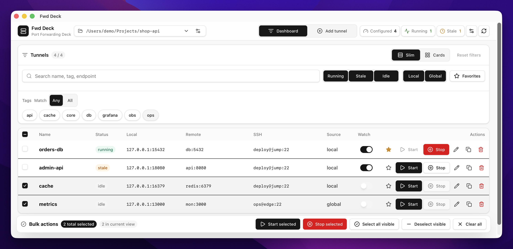

# fwd-deck

[](https://github.com/oiekjr/fwd-deck/actions/workflows/check.yml)
[](https://github.com/oiekjr/fwd-deck/releases)
[](LICENSE)

`fwd-deck` は、SSH のローカルポートフォワーディング設定を名前とタグで管理する CLI / macOSアプリです。  
設定ファイルに定義した複数の SSHトンネルを、起動、停止、状態確認、自動回復までまとめて扱えます。



## Features

- `name` と `tag` による SSHトンネル管理
- local設定と global設定の統合読み込み
- CLI と macOSアプリからの起動、停止、状態確認
- stale なトンネルの復旧と監視
- JSON出力、shell completion、設定検証、実行環境診断

## Install

Homebrew tap から CLI と macOSアプリをインストールできます。

```sh
brew install oiekjr/tap/fwd-deck
brew install --cask oiekjr/tap/fwd-deck-app
```

macOSアプリは当面、個人利用向けの unsigned app として配布します。  
Gatekeeper で起動が止まる場合は、次のどちらかで許可してください。

Option 1: Finder で `/Applications/Fwd Deck.app` を右クリックし、Open を選択します。  
Option 2: 一度起動を試した後に、`System Settings > Privacy & Security > Security > Open Anyway` から許可します。

## Quick Start

CLI で始める場合は、まずローカル設定ファイルを作成します。

```sh
cp fwd-deck.example.toml fwd-deck.toml
```

macOSアプリを初めて起動した場合は、global設定が未作成なら `~/.config/fwd-deck/config.toml` に同じ example 設定を自動作成します。

`fwd-deck.toml` を自分の SSH接続先に合わせて編集し、設定と実行環境を確認します。

```sh
fwd-deck validate
fwd-deck doctor
```

登録済みトンネルを確認し、SSH を起動する前に実行予定を確認します。

```sh
fwd-deck list
fwd-deck start dev-db --dry-run
```

問題がなければトンネルを起動し、状態を確認します。

```sh
fwd-deck start dev-db
fwd-deck status
```

停止する場合は `stop` を使います。

```sh
fwd-deck stop dev-db
```

## Documentation

CLIコマンド、設定ファイル、JSON出力の詳細は [CLI Reference](docs/cli.md) を参照してください。

セキュリティ報告の方針は [Security Policy](SECURITY.md) を参照してください。

## License

MIT License で公開しています。  
詳細は [LICENSE](LICENSE) を参照してください。
