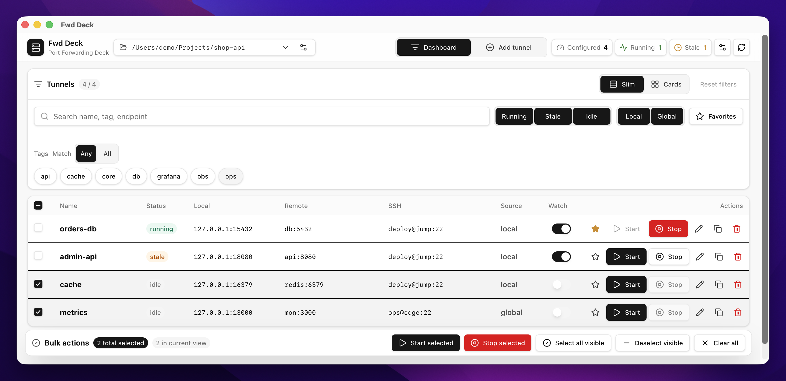

# fwd-deck

[](https://github.com/oiekjr/fwd-deck/actions/workflows/check.yml)
[](https://github.com/oiekjr/fwd-deck/releases)
[](LICENSE)

`fwd-deck` は、SSH のローカルポートフォワーディング設定を名前とタグで管理する CLI と macOSアプリです。  
設定ファイルに定義した複数の SSHトンネルを、起動、停止、状態確認、自動回復までまとめて扱えます。



## Features

- `name` と `tag` による SSHトンネル管理
- ローカル設定とグローバル設定の統合読み込み
- Git で共有できるポートフォワーディング設定ファイル
- CLI と macOSアプリからの起動、停止、状態確認
- stale状態のトンネルの復旧と監視
- 既存の SSHコマンドからのトンネル設定取り込み
- JSON出力、シェル補完、設定検証、実行環境診断

## Install

Homebrew tap から CLI と macOSアプリをインストールできます。

```sh
brew install oiekjr/tap/fwd-deck
brew install --cask oiekjr/tap/fwd-deck-app
```

macOSアプリは当面、個人利用向けの未署名アプリとして配布します。  
Gatekeeper で起動が止まる場合は、方法1の `Open Anyway` から許可する方法を推奨します。

方法1: 一度起動を試した後に、`System Settings > Privacy & Security > Security > Open Anyway` から許可します。  
方法2: Finder で `/Applications/Fwd Deck.app` を右クリックし、`Open` を選択します。

## Update

Homebrew でインストール済みの CLI と macOSアプリは、Homebrew の情報を更新してから対象ごとにアップグレードします。

```sh
brew update
brew upgrade fwd-deck
brew upgrade --cask fwd-deck-app
```

CLI または macOSアプリのどちらか一方だけを更新する場合は、対象の `brew upgrade` だけを実行してください。
macOSアプリが起動中の場合は、終了してから `brew upgrade --cask fwd-deck-app` を実行します。  
更新後のバージョンは次のコマンドで確認できます。

```sh
fwd-deck --version
brew list --cask --versions fwd-deck-app
```

`fwd-deck --version` は GitHub Releases の最新安定版も短時間確認し、新しいバージョンが公開されている場合だけ release URL と CLI更新コマンドを表示します。

## Quick Start

CLI で始める場合は、まずローカル設定ファイルを作成します。

```sh
cp fwd-deck.example.toml fwd-deck.toml
```

macOSアプリを初めて起動した場合は、グローバル設定が未作成であれば `~/.config/fwd-deck/config.toml` に同じ example 設定を自動作成します。

`fwd-deck.toml` を自分の SSH接続先に合わせて編集し、設定と実行環境を確認します。  
既存の SSHコマンドを使う場合は、`config import-ssh` で `-L` を設定ファイルへ取り込めます。

```sh
fwd-deck config import-ssh --scope local --name-prefix db -- ssh -N -L 15432:dev-db.example.com:5432 -L 15433:prod-db.example.com:5432 ec2-user@bastion.example.com
fwd-deck validate
fwd-deck doctor
```

登録済みトンネルを確認し、SSH を起動する前に実行予定を確認します。

```sh
fwd-deck list
fwd-deck start dev-db --dry-run
```

現在のディレクトリを macOSアプリの Workspace として開く場合は `open` を使います。  
macOSアプリが未インストールの場合は、先に Homebrew cask からインストールしてください。

```sh
fwd-deck open
fwd-deck open ~/projects/my-service
```

既存アプリが起動中の場合は、既存ウィンドウで Workspace を切り替えます。  
切り替え時は旧 Workspace の localスコープのトンネルを停止し、globalスコープのトンネルは維持します。

アプリ表示中は `Cmd+R` または `Ctrl+R` で Dashboard を再読み込みできます。

問題がなければトンネルを起動し、状態を確認します。

```sh
fwd-deck start dev-db
fwd-deck status
```

停止する場合は `stop` を使います。

```sh
fwd-deck stop dev-db
```

## Documentation

CLIコマンド、設定ファイル、JSON出力の詳細は [CLI Reference](docs/cli.md) を参照してください。

セキュリティ報告の方針は [Security Policy](SECURITY.md) を参照してください。

## License

MIT License で公開しています。  
詳細は [LICENSE](LICENSE) を参照してください。
